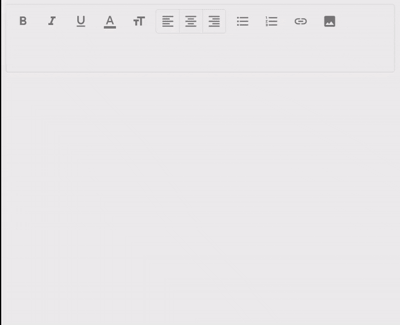

# @cronn/mui-rich-text-editor

A rich text editor component for React forms, built on [TipTap](https://tiptap.dev/), [Material UI](https://mui.com/), and [React Hook Form](https://react-hook-form.com/).



## Features

- Bold, italic, underline
- Font size (7 presets: 12–28 px)
- Text colour (9 presets)
- Text alignment (left / center / right)
- Bullet lists and numbered lists
- Hyperlinks — URL entry via a dialog
- Image upload with automatic downscaling (max 700 px wide)
- Read-only viewer mode
- Fully customizable labels / translations (German defaults)

## Installation

```bash
npm install @cronn/mui-rich-text-editor
```

Peer dependencies:

```bash
npm install \
  react react-dom \
  @mui/material @mui/icons-material @mui/system \
  @tiptap/core @tiptap/react @tiptap/starter-kit \
  @tiptap/extension-color @tiptap/extension-document \
  @tiptap/extension-image @tiptap/extension-link \
  @tiptap/extension-paragraph @tiptap/extension-text \
  @tiptap/extension-text-align @tiptap/extension-text-style \
  @tiptap/extension-underline @tiptap/extensions \
  prosemirror-state \
  react-hook-form
```

## Usage

See the **[live examples](https://cronn.github.io/mui-rich-text-editor/)** for working demos of:

- Basic form with React Hook Form (including the `createRichTextController` adapter)
- Read-only viewer (`RichTextViewer`)
- Disabled toolbar features (`disableLink`, `disableImageUpload`)
- Programmatic content updates via `forceSetValue`
- Custom translations (English override)

## `RichTextControl` props

| Prop                    | Type                                              | Default | Description                                              |
| ----------------------- | ------------------------------------------------- | ------- | -------------------------------------------------------- |
| `label`                 | `string`                                          | —       | Field label shown above the editor                       |
| `useController`         | `UseControllerHook<TFormValues>`                  | —       | Pre-wired RHF controller hook                            |
| `useForm`               | `() => UseCustomFormReturn<LinkDialogFormValues>` | —       | Form factory for the link-insertion dialog               |
| `useUrlFieldController` | `UseControllerHook<LinkDialogFormValues>`         | —       | Controller hook for the URL field inside the link dialog |
| `helperText`            | `string`                                          | —       | Hint text shown below the editor                         |
| `hideHelperText`        | `boolean`                                         | `false` | Suppress helper / error text entirely                    |
| `disabled`              | `boolean`                                         | `false` | Makes the editor non-editable and disables the toolbar   |
| `disableLink`           | `boolean`                                         | `false` | Hide the link button                                     |
| `disableImageUpload`    | `boolean`                                         | `false` | Hide the image upload button                             |
| `translations`          | `EditorToolbarTranslations`                       | German  | Override button labels and dialog copy                   |
| `ref`                   | `Ref<RichTextControlHandle>`                      | —       | Imperative handle for `forceSetValue`                    |

## Translations

All visible strings default to German. Pass a `translations` object to `RichTextControl` to override any or all of them. Individual sub-components expose their own translation types if you need them:

```ts
import type {
  AlignToggleButtonGroupTranslations,
  FontColorDropdownTranslations,
  ImageUploadButtonTranslations,
  LinkButtonTranslations,
  LinkDialogTranslations,
} from "@cronn/mui-rich-text-editor";
```

## Contributing

```bash
pnpm install        # install dependencies
pnpm test:unit      # run the test suite
pnpm build          # build the dist/ folder
```

To cut a release, add a changeset describing the change, then open a PR against `main`:

```bash
pnpm changeset      # choose patch / minor / major and write the changelog entry
```

Merging the PR triggers the release pipeline, which opens a version PR. Merging that version PR publishes to npm automatically.

## License

Apache-2.0 © [cronn GmbH](https://www.cronn.de)
